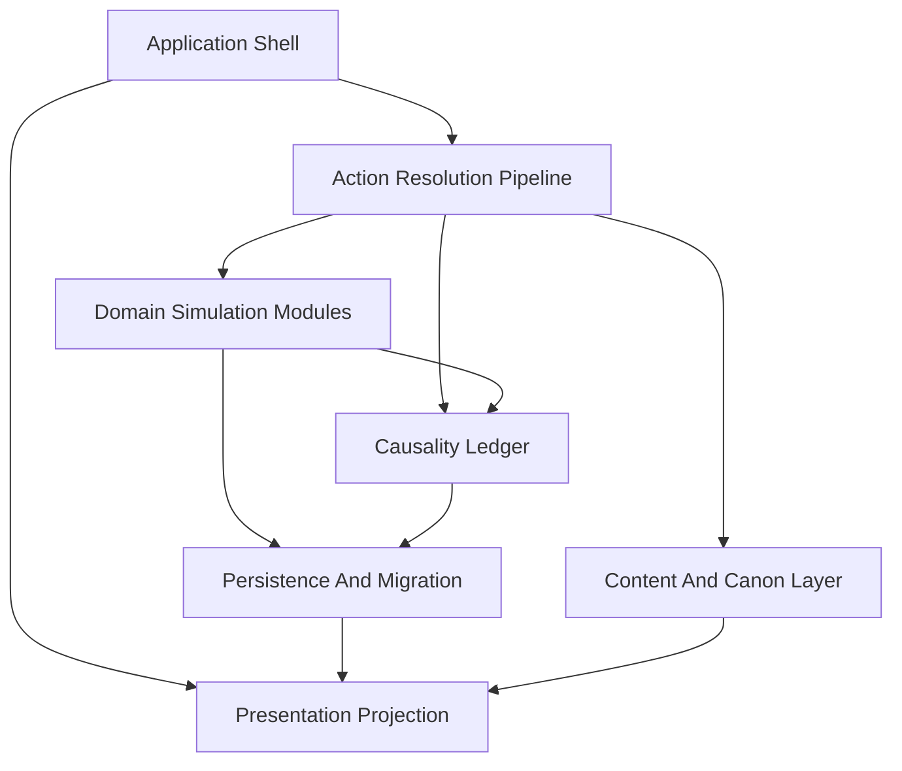

# RebrnG 正式逻辑架构设计 v1.0

状态：frozen

更新时间：2026-04-26

关联文档：
- [2026-04-26-reborng-a-scheme-design.md](./2026-04-26-reborng-a-scheme-design.md)
- [2026-04-26-reborng-launch-vertical-slice-spec.md](./2026-04-26-reborng-launch-vertical-slice-spec.md)
- [2026-04-26-reborng-architecture-input-checklist.md](./2026-04-26-reborng-architecture-input-checklist.md)
- [2026-04-26-reborng-longterm-extension-state-boundary-spec.md](./2026-04-26-reborng-longterm-extension-state-boundary-spec.md)

适用范围：新项目 `D:\workspace\CodeBuddyWorkSpace\RebrnG_new`

## 文档角色

本文档是 RebrnG 的第一份正式逻辑架构设计。

它负责冻结以下内容：

- 模块边界
- 核心状态对象
- 行动结算管线
- 内容与模式门禁
- 子系统契约
- 存档与状态迁移原则
- 架构验收场景

本文档不负责冻结以下内容：

- 编程语言
- 前端框架
- 后端框架
- 数据库或本地存储实现
- 具体目录结构
- 具体 UI 技术
- LLM 接入方式

这些属于后续技术架构文档。

## Summary

本架构采用“逻辑架构先行”。首发只实现青茅山 S0 纵切，但底层状态边界必须能承接 S1-S4，包括升仙、仙窍经营、宝黄天、杀招、阵、仙蛊屋、组织委托和尊者级 IF。

核心原则：

- `规则状态层` 与 `叙事呈现层` 分离。游戏事实只由规则引擎写入，文本生成只负责表达、上下文化和局部变体。
- `首发求活循环` 是基础循环，升仙、仙窍、宝黄天、阵、仙蛊屋是后续子循环，不重写底座。
- `canon_strict` 与 `sandbox_if` 共用同一状态结构，只通过模式策略、内容门禁、锚点容差和 IF 许可度产生差异。
- 存档采用 `状态快照 + 因果账本 + 内容版本引用`，支持阶段存档和跨阶段迁移。
- UI 只消费账本投影，不直接持有玩法真相。

## 架构总览

正式逻辑架构分为 7 层：

1. `Application Shell`
2. `Presentation Projection`
3. `Action Resolution Pipeline`
4. `Domain Simulation Modules`
5. `Content And Canon Layer`
6. `Causality Ledger`
7. `Persistence And Migration`

层级关系：

### 1. Application Shell

职责：

- 启动游戏
- 选择模式
- 新开局
- 读档
- 输入转发
- 页面路由
- 退出和存档入口

禁止：

- 直接改角色资源
- 直接改 AP
- 直接改关系、债务、锚点、资产或 Build
- 绕过行动结算管线调用具体规则模块

### 2. Presentation Projection

职责：

- 把规则状态投影到账本 UI
- 生成正文场景页所需的显示模型
- 生成节点地图页、债务页、关系页、Build 页、线索页、仙窍页、交易页、部署页的显示模型
- 暴露“玩家此刻可理解的信息”，而不是暴露所有隐藏状态

禁止：

- 自行创造规则事实
- 自行决定行动成功或失败
- 自行结算资源、伤势、暴露、债务或锚点

### 3. Action Resolution Pipeline

职责：

- 接收所有玩家行动
- 检查行动是否可用
- 预占成本
- 调用子系统结算
- 回算锚点和世界变量
- 提交效果
- 写入因果账本
- 刷新 UI 投影

所有玩家操作都必须进入该管线，不允许按 UI 页面分别写规则。

### 4. Domain Simulation Modules

职责：

- 承载可复用的规则系统
- 只通过管线读写状态
- 返回标准化结算结果
- 不负责 UI 文案

首发必须实现的模块：

- `TimeAndWindowSystem`
- `WorldSpaceSystem`
- `EconomyDebtSystem`
- `EncounterConsequenceSystem`
- `CultivationBuildSystem`
- `FactionRelationshipSystem`
- `LedgerProjectionSystem`
- `SaveMigrationSystem`

中后期必须预留的模块：

- `ApertureManagementSystem`
- `TradeSystem`
- `DeploymentSystem`

### 5. Content And Canon Layer

职责：

- 管理内容包
- 管理证据等级
- 管理原著锚点
- 管理模式门禁
- 管理离线策展素材
- 管理实时叙事变体边界

原则：

- 离线策展内容是玩法真相来源。
- 实时层是叙事包装与小变体来源。
- 实时生成不能现场裸生关键奖励、硬事实、原著人物命运或核心资源结果。

### 6. Causality Ledger

职责：

- 记录可见因果
- 记录隐藏世界变量征兆
- 记录锚点压力
- 记录近期代价来源
- 记录后续追索原因
- 支撑玩家回看“为什么变成现在这样”

因果账本不是日志文件。它是玩家理解游戏世界的核心界面数据。

### 7. Persistence And Migration

职责：

- 保存状态快照
- 保存因果账本
- 保存阶段检查点
- 保存内容版本引用
- 保存 RNG 状态
- 保存跨阶段迁移信息
- 为未来版本升级保留迁移位

## 核心状态对象

正式架构必须显式建模以下状态。

禁止把这些状态塞进一个大 `misc`、单一 `currentRegion` 或无法迁移的临时字段。

### RunState

表示一局游戏的顶层运行上下文。

至少包含：

- 模式：`canon_strict` 或 `sandbox_if`
- 当前阶段：S0-S4
- 当前章节
- 当前窗口引用
- RNG 种子或 RNG 状态
- 内容包版本
- 存档版本

### TimeState

表示时间、窗口和 AP。

至少包含：

- 章节日
- 四时段：清晨、日中、傍晚、深夜
- 窗口类型：自由窗口、锚点窗口、跳时窗口
- 当前 AP
- AP 浮动来源
- 锚点队列
- 条件锚点状态
- 超期锚点状态
- 跳时状态

### WorldSpaceState

表示世界空间，不等于单一当前位置。

至少包含：

- 局部节点图
- 地区层
- 跨图区
- 仙窍内空间
- 交易空间
- 隐藏接入口
- 路线与门路
- 五域天地二气适配风险
- 仙窍落地补气窗口

### CharacterState

表示主角自身。

至少包含：

- 身份
- 修为阶段
- 空窍 / 仙窍承载关系
- 伤势
- 恢复状态
- 关系状态引用
- 势力压力引用
- 可见后遗症
- 隐藏后遗症

首发默认单主角，但状态结构不能阻止后续资产、部署物、挂单和组织托管物参与结算。

### ResourceState

表示资源层。

必须分为：

- 凡人层资源：元石、材料、功绩、药堂债相关资源、人情。
- 蛊仙层资源：仙元、仙材、仙窍产出、交易信用、宝黄天挂单能力、五域天地二气适配余裕。
- 部署与组织层资源：阵位、仙蛊屋部件位、组织供给、委托资格。

禁止把凡人经济、蛊仙经济和部署供给压成同一种货币。

### DebtAndCreditState

表示债务与信用。

至少包含：

- 药堂债
- 人情债
- 家族或组织债
- 黑市追索
- 委托债
- 宝黄天交易信用

原则：

- 债务是追索压力。
- 信用是交易后果和资格。
- 二者可以互相影响，但不能混成一个字段。

### BuildState

表示玩家如何活、如何战、如何经营。

必须分层：

- 求活路线层
- 主修流派 / 道痕层
- 蛊组合层
- 杀招层
- 场域部署层
- 经营支撑层
- 维持负担层

Build 不是一页蛊列表，也不是职业。

### AssetOwnershipState

表示资产在哪、归谁控制、是否可调用。

至少包含以下容器：

- 随身
- 落脚点
- 仙窍内
- 组织托管
- 挂单中
- 部署中

同一资产转移容器时，必须保留：

- 资产身份
- 损伤状态
- 喂养或维护负担
- 可调用性
- 暴露或追索影响

### ApertureState

表示空窍到仙窍的长期承载结构。

至少包含：

- 空窍状态
- 初成福地质量
- 洞天跃迁位
- 时间流速
- 灾劫周期
- 产出结构
- 蛊虫喂养负担
- 维护负担
- 五域天地二气适配
- 落地补气窗口

首发只需要空窍和凡人修行状态，但架构字段必须允许后续迁移到仙窍经营。

### TradeState

表示交易系统。

至少包含：

- 地方交易
- 组织内部调配
- 跨图交换
- 宝黄天接入媒介
- 神念 / 意志交互负担
- 交易能见度
- 价值显露状态
- 挂单资格
- 履约状态
- 信用后果

宝黄天不是黑市升级版，也不是高级商店。

### KnowledgeState

表示玩家知道什么。

至少包含：

- 风声
- 线索
- 传闻
- 已验真事实
- 误导来源
- 证据等级
- 内容模式许可

知识状态直接影响 `canon_strict` 和 `sandbox_if` 的内容可见性。

### AnchorState

表示原著锚点与世界压力。

至少包含：

- 原著锚点
- 条件锚点
- 超期锚点
- 锚点压力
- 时间线偏移
- 天意关注的间接征兆
- 核心人物保护状态

隐藏变量不直接数值化显示，只能通过征兆、梦兆、风声、巧合和人物反应投影。

## 行动结算接口

所有玩家操作都抽象为 `ActionCommand`。

### ActionCommand

最小逻辑字段：

- `actor`：行动者，首发默认玩家单主角。
- `intent`：行动意图，例如移动、修行、交易、侦查、跑路、恢复、部署。
- `target`：节点、角色、资产、线索、交易单、阵位等。
- `declaredCost`：玩家可见的 AP、资源、时间或风险代价。
- `context`：当前窗口、地点、模式、Build、暴露、债务、锚点压力。

### ActionResult

最小逻辑字段：

- `accepted`：行动是否被允许进入结算。
- `visibleOutcome`：玩家可见结果。
- `statePatch`：待提交状态变更。
- `ledgerEntries`：因果账本条目。
- `hiddenSignals`：隐藏世界变量征兆。
- `projectionHints`：UI 投影刷新提示。

### 固定管线顺序

1. `Availability Check`
2. `Cost Reservation`
3. `Subsystem Resolution`
4. `Anchor Recalculation`
5. `Effect Commit`
6. `Ledger Append`
7. `Projection Refresh`

#### 1. Availability Check

检查：

- 时段
- 地点
- AP
- 关系
- 证据门禁
- 模式许可
- 资产可调用性
- 锚点压力

#### 2. Cost Reservation

预占：

- AP
- 时间
- 资源
- 债务
- 人情
- 暴露
- 空间占用

#### 3. Subsystem Resolution

由相关规则模块计算：

- 收益
- 风险
- 伤势
- 暴露
- 关系变化
- 债务变化
- Build 演进
- 线索变化

#### 4. Anchor Recalculation

回算：

- 锚点状态
- 隐藏变量
- 时间线偏移
- 世界反应
- 原著核心人物保护

#### 5. Effect Commit

统一提交：

- 状态快照变更
- 资产容器变更
- 资源债务变更
- 关系势力变更
- 知识与线索变更

模块不得绕过该步骤直接修改全局状态。

#### 6. Ledger Append

写入：

- 可见因果
- 隐藏征兆
- 后续追索来源
- 玩家可回看的选择痕迹

#### 7. Projection Refresh

刷新：

- 正文场景页
- 地图页
- 债务页
- 关系页
- Build 页
- 线索页
- 仙窍页
- 交易页
- 部署页

## 内容与模式门禁

内容系统必须是独立层，不嵌进规则模块。

### 内容资产最低字段

每个内容资产至少要有：

- `contentId`
- 阶段
- 地区
- 节点或路线标签
- 证据等级
- 模式许可
- 效果模板
- 可见性条件
- 锚点影响声明

### 证据等级

架构层至少保留：

- `canon_explicit`
- `canon_inferred`
- `if_allowed`
- `original_playable`
- `rumor_only`

### canon_strict

`canon_strict` 只允许 `canon_explicit` 与 `canon_inferred` 进入：

- 关键事件
- 关键奖励
- 原著人物硬事实
- 主线锚点
- 重大交易结果
- 核心因果

缺证据内容只能：

- 延后
- 转为风声
- 留作 IF
- 被禁用

### sandbox_if

`sandbox_if` 可以启用：

- 原创补完
- 锚点偏移
- 高风险侧线
- 更早的灰路内容

但仍必须经过：

- 世界规则门禁
- 阶段门禁
- 空间门禁
- Build 门禁
- 资源门禁
- 主线保护门禁

### 实时生成边界

实时生成只允许负责：

- 语气统一
- 局部变体
- 上下文化
- 因果承接表达
- 状态映射成文本

实时生成禁止负责：

- 关键奖励生成
- 原著硬事实生成
- 原著核心人物命运改写
- 资源结果现场裸生
- 锚点结果现场裸生

## 子系统契约

### TimeAndWindowSystem

职责：

- 管理四时段
- 管理自由窗口
- 管理锚点窗口
- 管理 AP 刷新
- 管理跳时
- 管理阶段存档点

输入：

- 当前章节日
- 当前时段
- 当前窗口类型
- 锚点队列
- 伤势和恢复压力

输出：

- 可用 AP
- 可行动窗口
- 跳时结果
- 锚点触发请求

### WorldSpaceSystem

职责：

- 管理节点
- 管理路线
- 管理移动代价
- 管理跨图
- 管理五域天地二气适配
- 管理仙窍补气压力

输入：

- 当前节点
- 当前地区
- 路线类型
- 时段
- 暴露
- 伤势
- 门路

输出：

- 可达节点
- 移动成本
- 暴露变化
- 跨区风险
- 补气压力变化

### EconomyDebtSystem

职责：

- 管理元石
- 管理材料
- 管理功绩
- 管理债务
- 管理人情
- 管理黑市门路
- 管理交易信用分层

输入：

- 当前资源
- 当前债务
- 当前功绩
- 关系与势力
- 行动成本

输出：

- 资源变化
- 债务变化
- 价格变化
- 追索压力
- 信用后果

### EncounterConsequenceSystem

职责：

- 管理遭遇战
- 管理侦查
- 管理跑路
- 管理拖延
- 管理求饶
- 管理嫁祸
- 管理重创可续

输入：

- 当前遭遇
- 准备信息
- Build
- 伤势
- 暴露
- 地点与时段

输出：

- 胜败结果
- 伤势
- 残蛊
- 债务
- 暴露
- 路线断裂
- 死亡或阶段性失败

### CultivationBuildSystem

职责：

- 管理修为推进
- 管理求活路线
- 管理主修流派
- 管理道痕
- 管理蛊组合
- 管理杀招
- 管理阵
- 管理仙蛊屋
- 管理喂养维护负担

输入：

- 修为
- 核心蛊
- Build 分层
- 资源
- 关系债务
- 线索传承

输出：

- 修为变化
- Build 演进
- 缺口变化
- 喂养压力
- 高阶部署资格

### ApertureManagementSystem

职责：

- 管理福地阶段
- 管理洞天跃迁位
- 管理时间流速
- 管理灾劫周期
- 管理仙窍产出
- 管理喂养与维护
- 管理天地二气补充压力

输入：

- 修为阶段
- 仙窍状态
- 资产驻留
- 产出结构
- 灾劫周期
- 地区与五域适配

输出：

- 产出
- 维护消耗
- 灾劫压力
- 补气压力
- Build 支撑能力

### TradeSystem

职责：

- 管理地方交易
- 管理组织调配
- 管理跨图交换
- 管理宝黄天媒介接入
- 管理神念 / 意志交互
- 管理交易能见度
- 管理挂单资格
- 管理信用后果

输入：

- 可交易资产
- 仙窍产出
- 接入媒介
- 交易能见度
- 信用
- 空间可达性

输出：

- 交易结果
- 挂单状态
- 履约后果
- 信用变化
- 供需线索

### FactionRelationshipSystem

职责：

- 管理庇护
- 管理利用
- 管理委托
- 管理站队
- 管理组织债
- 管理长期关系后果

输入：

- 当前关系
- 身份
- 债务
- 委托
- 暴露
- 锚点压力

输出：

- 关系变化
- 保护或追索
- 委托机会
- 组织供给
- 站队后果

### LedgerProjectionSystem

职责：

- 把状态变化转成因果账
- 把隐藏变量转成征兆
- 把债务转成债务账
- 把 Build 转成路线与缺口页
- 把危机转成前置提示

输入：

- 完整规则状态
- 账本事件
- 可见性策略
- 模式策略

输出：

- UI 投影模型
- 正文提示上下文
- 可回看记录
- 风声与线索显示

### SaveMigrationSystem

职责：

- 管理状态快照
- 管理阶段存档
- 管理内容版本
- 管理 RNG 状态
- 管理跨阶段迁移
- 管理未来版本兼容

输入：

- 当前完整状态
- 因果账本
- 内容包版本
- 存档版本

输出：

- `SaveEnvelope`
- 可读回快照
- 阶段检查点
- 迁移报告

## 存档设计

存档逻辑对象为 `SaveEnvelope`。

### SaveEnvelope

至少包含：

- `metadata`
- `snapshot`
- `ledger`
- `checkpoints`
- `rngState`
- `migrationState`

### metadata

至少包含：

- 存档版本
- 创建时间
- 模式
- 当前阶段
- 当前章节
- 内容包版本

### snapshot

保存当前完整规则状态。

必须包含：

- RunState
- TimeState
- WorldSpaceState
- CharacterState
- ResourceState
- DebtAndCreditState
- BuildState
- AssetOwnershipState
- ApertureState
- TradeState
- KnowledgeState
- AnchorState

### ledger

保存：

- 近期因果账本
- 关键历史
- 可回看选择
- 隐藏变量征兆记录
- 后续追索来源

### checkpoints

保存阶段存档点。

原则：

- 支持中长局分次游玩。
- 不允许每个选择无限回退。
- 阶段检查点必须比普通自动保存更稳定。

### rngState

用于保证：

- 同一存档读回后，规则结算可复现。
- 内容版本一致时，同一状态下的后续结算不漂移。

### migrationState

记录：

- 跨阶段迁移状态
- 存档版本升级信息
- 内容版本兼容信息
- 升仙时结构迁移痕迹

## 跨阶段迁移

### S0 到 S1

必须保留：

- 求活路线
- 关系债务
- 伤势后遗症
- 核心蛊
- 资产容器
- 证据与线索
- 锚点状态

可以弱化：

- 首发局部节点热度
- 低价值短期传闻
- 已失效的本地价格波动

### 凡人到升仙

必须迁移：

- 修为前史
- Build 分层
- 主修流派 / 道痕基础
- 债务与关系后果
- 资产容器
- 空窍到仙窍承载关系
- 初成福地质量
- 灾劫周期
- 仙窍经营负担

禁止：

- 升仙后清空债务和关系。
- 升仙后把 Build 重置成新职业。
- 升仙后把凡人前史只当文本回忆。

### 蛊仙中后期

必须保留：

- 仙窍经营状态
- 喂养维护负担
- 宝黄天信用
- 交易挂单
- 组织委托
- 部署资产
- 阵与仙蛊屋状态
- 五域天地二气适配
- 补气窗口

## UI 架构约束

UI 架构采用账本母体。

固定原则：

- UI 只消费 `Presentation Projection`。
- UI 不直接读隐藏状态。
- UI 不直接调用规则模块。
- UI 不直接写资源、债务、关系、Build 或锚点。

首发页：

- 正文场景页
- 因果账本页
- 节点地图页
- 物资与债务页
- 关系局势页
- 空窍 / 修行页
- Build 页
- 风声与线索页

中后期扩展页：

- 仙窍经营页
- 宝黄天交易页
- 阵与仙蛊屋部署页
- 组织委托页

所有新增页必须归入账本母体，不允许换成另一套经营壳。

## 架构禁止项

正式实现中禁止出现以下设计：

- 一个 `currentRegion` 承担节点、地区、跨图、仙窍和交易空间。
- 一个 `route` 字段同时承担求活路线、主修流派和道痕。
- 一个 `resource` 字段混合凡人资源、仙材、仙元和组织供给。
- 一个 `debt` 字段混合药堂债、人情债、组织债和宝黄天信用。
- 一个 `inventory` 字段承担随身、落脚点、仙窍、托管、挂单和部署。
- UI 页面直接修改规则状态。
- 实时生成直接产出关键奖励或硬事实。
- 中后期系统绕过首发主循环重新写一套游戏。

## 架构验收场景

### S0 8 回合闭环

固定开局能跑完 8 个自由回合。

验收点：

- AP 通过统一时间窗口结算。
- 锚点通过统一 AnchorState 触发。
- 资源、暴露、债务、路线分化通过统一管线写回。
- 因果账本能解释主要压力来源。

### 移动不是 AP 税

近距、中距、远距、夜间、隐藏节点移动能产生不同结果。

验收点：

- 移动可以消耗窗口、抬高暴露、压缩到达后 AP 或触发路上风险。
- 不依赖固定扣 1 AP 解释所有移动。

### canon_strict 门禁

缺证据内容不能进入关键奖励、原著人物硬事实、主线锚点和交易结果。

验收点：

- 内容资产证据等级会影响可用性。
- 实时生成不能绕过证据门禁。

### sandbox_if 门禁

IF 内容可以启用，但仍受阶段、空间、资源、Build 和主线保护限制。

验收点：

- IF 内容不会变成无限自由。
- 主线保护仍然存在。

### 重创可续

战败后能进入伤势、残蛊、债务、暴露、路线断裂等后果。

验收点：

- 死亡不是唯一失败形态。
- 失败后果能被账本和后续行动读取。

### Build 分层

求活路线、主修流派 / 道痕、蛊组合、杀招、阵、仙蛊屋能分别存在并共同影响行动。

验收点：

- 求活路线不会吞掉流派。
- 蛊组合不会吞掉杀招、阵和仙蛊屋。

### 资产容器转移

同一资产能在随身、落脚点、仙窍、托管、挂单、部署之间转移。

验收点：

- 资产身份不丢。
- 损伤、喂养、维护、暴露和可调用性不丢。

### 升仙迁移

凡人状态能迁移到蛊仙阶段。

验收点：

- 生成初成福地质量。
- 生成灾劫周期。
- 生成仙窍经营负担。
- 凡人前史继续影响关系、债务和 Build。

### 宝黄天交易

交易必须经过接入媒介、神念 / 意志交互、能见度、挂单资格和信用后果。

验收点：

- 宝黄天不是商城。
- 黑市不是宝黄天前身。
- 信用不是债务的别名。

### 存档复现

阶段存档读回后，规则状态、账本投影、内容版本和锚点压力一致。

验收点：

- 存档含内容版本。
- 存档含 RNG 状态。
- 存档含因果账本。
- 存档含迁移状态。

## 后续技术架构输入

后续技术架构文档必须基于本文档回答：

- 使用什么语言与运行时
- 如何表达状态类型
- 如何表达行动管线
- 如何表达内容资产
- 如何存档和迁移
- 如何测试规则模块
- 如何接入文本生成
- 如何组织 UI 投影

技术架构不得重新发明本文档已冻结的逻辑边界。

## Assumptions

- 本设计以当前工作区内最新 `docs` 为准，包括尚未提交的 canon 修订。
- 本轮只定义逻辑架构；语言、框架、目录结构、数据库、具体 UI 技术和 LLM 接入方式后置。
- 首发实现只需要覆盖 S0 青茅山纵切，但架构状态边界必须能承接 S1-S4。
- 默认单机 PC 优先，不设计联网、多人、云存档或服务端权威结算。
- 实时文本生成不能成为规则事实来源；所有规则效果必须来自策展内容、规则模块或明确的状态模板。

## 归档说明

- 本文档为正式逻辑架构设计初版。
- 后续技术架构、目录结构和实现计划必须引用本文档。
- 当前归档路径：

`docs/superpowers/specs/2026-04-26-reborng-logical-architecture-design.md`
